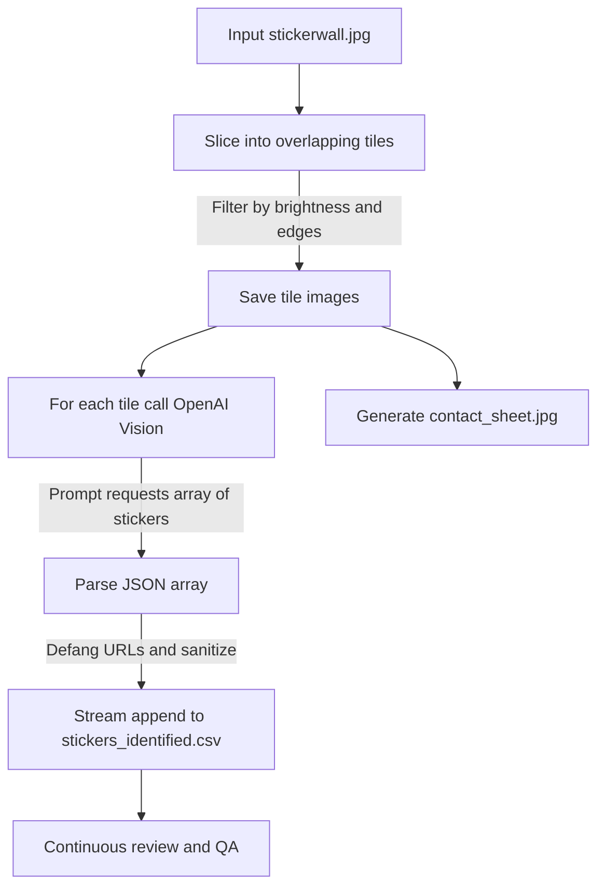

```
              ▒█████████▒                                                                                                        
             █████████████                                                                                                       
            ███   ███   ███                                                                                                      
    ████   ████   ███   ████    ▓▓                                                                                             
    ▓██░  ░██ ▒█████████░ ██   ████                                                                                            
  ░███████░██ ██████████▒ ██   █████      ░▒▓███████▓▒░░▒▓████████▓▒░▒▓████████▓▒░     ░▒▓██████▓▒░ ░▒▓██████▓▒░░▒▓███████▓▒░  
   ██▒ ▓██████ ▒███████  ███████████▓     ░▒▓█▓▒░░▒▓█▓▒░▒▓█▓▒░      ░▒▓█▓▒░           ░▒▓█▓▒░░▒▓█▓▒░▒▓█▓▒░░▒▓█▓▒░▒▓█▓▒░░▒▓█▓▒░ 
           ██████     ███████▒            ░▒▓█▓▒░░▒▓█▓▒░▒▓█▓▒░      ░▒▓█▓▒░           ░▒▓█▓▒░      ░▒▓█▓▒░░▒▓█▓▒░▒▓█▓▒░░▒▓█▓▒░ 
              ███████████▓                ░▒▓█▓▒░░▒▓█▓▒░▒▓██████▓▒░ ░▒▓██████▓▒░      ░▒▓█▓▒░      ░▒▓█▓▒░░▒▓█▓▒░▒▓█▓▒░░▒▓█▓▒░ 
                 ▓█████                   ░▒▓█▓▒░░▒▓█▓▒░▒▓█▓▒░      ░▒▓█▓▒░           ░▒▓█▓▒░      ░▒▓█▓▒░░▒▓█▓▒░▒▓█▓▒░░▒▓█▓▒░ 
            ██████   █████▒               ░▒▓█▓▒░░▒▓█▓▒░▒▓█▓▒░      ░▒▓█▓▒░           ░▒▓█▓▒░░▒▓█▓▒░▒▓█▓▒░░▒▓█▓▒░▒▓█▓▒░░▒▓█▓▒░ 
    ▒███▒█████░         ▓█████▓██▒        ░▒▓███████▓▒░░▒▓████████▓▒░▒▓█▓▒░            ░▒▓██████▓▒░ ░▒▓██████▓▒░░▒▓█▓▒░░▒▓█▓▒░ 
     █████▒                ░█████                                                                                                                                        
      ████                   ███                                                                                                                                         
       ██                    ██                                                                                                                                          

    _ ____|____________________________________________ ____  /\_____ __________________________________________________|____ _ _
          |                                                 \/                  STICKERWALL IDENTIFIER & INDEXER v0.23  |
```


Slice a large sticker wall into overlapping tiles, identify all stickers per tile with OpenAI Vision, and stream results to CSV in real time.

<p align="center">
  
</p>


## Why

* Larger tiles with overlap to capture full stickers
* Multi object detection per tile via model guidance
* Streaming writes to CSV so you can tail results as they arrive
* Defanged websites in the output for safe sharing
* Security first design with minimal dependencies and local processing

## Quick start

```bash
# 1. Create and activate a virtualenv, then install deps
python3 -m venv .venv_stickers
source .venv_stickers/bin/activate
pip install -r requirements.txt

# 2. Configure OpenAI
export OPENAI_API_KEY="sk-..."; export OPENAI_VISION_MODEL="gpt-4o-mini"

# 3. Run
python sticker_id_auto.py \
  --input wall.jpg \
  --outdir stickers_out \
  --tile-w 300 --tile-h 300 \
  --stride-x 200 --stride-y 200 \
  --min-brightness 8 \
  --min-edge-mean 2 \
  --format jpg \
  --contact-sheet \
  --rate-limit 1.0
```

Outputs

* `stickers_out/tiles/*.jpg`
* `stickers_out/stickers.csv` raw tiles
* `stickers_out/stickers_identified.csv` multi row results streamed as processed
* `stickers_out/auto_id.log` run log
* `stickers_out/contact_sheet.jpg` optional visual index

## Mermaid pipeline



## CSV schema

`stickers_identified.csv` fields

* `thumbnail` file name of the tile image
* `x` `y` top left pixel coordinate in the original wall
* `tile_w` `tile_h` tile dimensions
* `mean_brightness` `edge_mean` filter metrics
* `name` model reported name per detected sticker
* `category` freeform category such as conference or tool
* `notes` short notes or raw fallback text
* `confidence` 0 to 1 if provided
* `website` defanged, example hxxps\://defcon\[.]org
* `model` vision model used
* `tile_index` index of the item within the tile if multiple

## Tuning

* Increase `--tile-w` and `--tile-h` for bigger crops
* Reduce `--stride-x` and `--stride-y` to increase overlap and reduce cutoff risk
* Lower `--min-brightness` and `--min-edge-mean` to keep more tiles
* `--max-tiles` can cap processing for a fast reconnaissance pass

## Prompt strategy

The default prompt asks for an array of objects with fields
`name, category, confidence, notes, website`.
The parser accepts either an array or single object. It also removes code fences.
If parsing fails, the script falls back to a single row that preserves raw text in `notes`.

## Security model

* No network calls beyond the OpenAI API
* Local slicing and file IO only
* URLs are defanged before writing to CSV
* Logs stored locally under `stickers_out/auto_id.log`
* Environment variables via `python-dotenv` supported if you prefer a `.env` file

## Example monitoring

```bash
tail -f stickers_out/auto_id.log
tail -f stickers_out/stickers_identified.csv
```

## Minimal requirements

See `requirements.txt`

```
pillow
numpy
python-dotenv
openai
tenacity
```

## Troubleshooting

* `OPENAI_API_KEY missing`
  Set `export OPENAI_API_KEY="sk-..."` or use a `.env` file.

* CSV rows look like one sticker per tile
  Verify you are running the multi result script and did not override `--prompt`.

* Too many cut stickers
  Increase tile size and reduce stride. Example 384 by 384 tiles with 160 stride.

* False positives or noisy results
  Add a post filter that drops items with `confidence < 0.4`, or add a second pass that merges duplicates by `name` and keeps the highest confidence.

## Roadmap

* Optional OpenCV based blob segmentation to isolate stickers before classification
* Duplicate suppression with perceptual hashing on crops
* Confidence calibration using few shot examp
